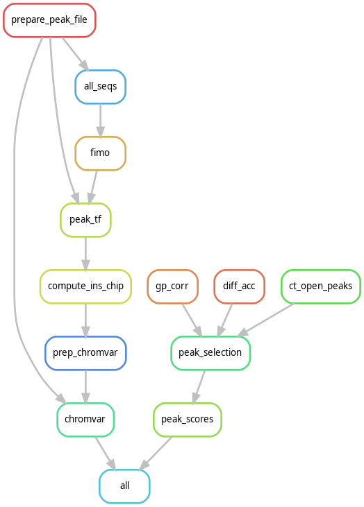

# geneTF

This repository contains a [`snakemake`](https://snakemake.readthedocs.io/en/stable/) pipeline to produce `gene x TF` matrices, representing the regulatory potential of TFs on genes.

A `snakemake` pipeline is constructed using a set of *rules* with defined inputs and outputs.

## Overview:

Below is a DAG showing the rule dependencies in the `snakemake` pipeline. View the `Snakefile` to see details on each rule.



## Types of `gene x TF` matrices produced

Three versions of the `gene x TF` matrix are produced, each with a different proxy for quantifying regulation:

* sum of gene accessibility from ATAC
* sum of FIMO scores
* average gene accessibility, weighted by FIMO scores

## Environment Setup
In order to run this pipeline, certain python and R packages need to be installed. We will also rely on the `module load` system provide by SciComp. 

Importantly, the `environment.yaml`/`requirements.txt` files include the `snakemake` package.

### Python Modules
1. Load Anaconda:

```
module load Anaconda3/2020.02
```

2. Create the conda environment 

There are two options, using `pip` vs using `conda`

With `conda`:

```
conda env create -n env_name --file envs/environment.yaml

conda activate env_name
```

With `pip`:

In an activated, bare `conda` environment:

```
pip install -r envs/requirements.txt
```

### R modules

To ensure the project runs smoothly, an `renv.lock` file is included under the `envs/` directory. Using the [`renv` package](https://rstudio.github.io/renv/index.html) makes it easy to distribute the required packages and their correct versions.

If `renv` is not yet installed, run:

```
snakemake --cores 1 renv_install --config renv_loc="path/to/user/R/library"
```
**NOTE:** `--cores` can tell `snakemake` how many cores are available for use. It will automatically run the jobs in parallel, if possible.


This will run the `snakemake` rule that will:
1. Load the R module
2. Install the `renv` package into the library location specified above

Next, we can install all the required R packages:

```
snakemake --cores 1 renv_init_restore
```

## Modify the `config.yaml` file

For each project using this pipeline, parameters can be set in the configuration file located at:
```
config/config.yaml
```

In order for the pipeline to run, you will have to set the following parameters:

* `atac` *str* : Path to the SEACell level ATAC AnnData
* `rna` *str* : Path to the SEACell level RNA AnnData

**NOTE:** The RNA and ATAC SEACell AnnDatas should have matched `obs_names`

### Optional Parameters:
For the following parameters, default values can be used

**NOTE:** Make sure the `in_meme` file is appropriate for the chosen `genome`

* `in_meme` *str* : Path to the `.meme` file for FIMO, `default=CIS-BP_2.00/Homo_sapiens.meme`
    * Other motif databases can be found at: `/fh/fast/setty_m/grp/motif_databases/`
* `width` *int* : Number of base pairs to resize ATAC peaks to. The summit will be the midpoint, `default=150`
* `genome` *str* : Genome to use, will be referenced in the `all_seqs` and `gp_corr` rules, `default=hg38`
    * Currently supported genomes include:  
        * hg38
        * hg19
        * hg18
        * mm9
        * mm10
* `n_jobs` *int* : Number of cores for the `gp_rule`, `default=1`
* `test_set` *str/flag* : Whether to generate a test set, `default=""` (False), set to `"--test_set"` for True 
* `n_genes` *int* : number of genes to use in test set, if applicable, `default=20`
* `min_corr` *float* : minimum gene-peak correlation to pass filtering, `default=0.0`
* `max_pval` *float* : max p-value for gene-peak correlation to pass filtering, `default=0.1`
* `min_peaks` *int* : minimum number of significant peaks to pass gene filtering,  `default=2`


### Alternative config specification

Instead of altering the `config.yaml` file directly, you can also pass the params using the keys in the config file on the command line.

For example if we wanted to generate a test_set:

```
snakemake --cores 1 all --config test_set="--test_set"
```

## Optional: Download `hg38.gtf`

For convenience, I have included a rule to download the *hg38.gtf* file into a data directory for use in the `gp_corr` rule.

```
snakemake --cores 1 dl_hg38
```

If a different genome is being used, create a `data/` directory and place the `.gtf` file inside. Modify the `config.yaml`, respectively.

## Running the pipeline

After the environment has been set up and the configuration file is set, the pipeline is ready to run!

**NOTE:** Reccommended to run on `gizmo`, not `rhino`! Cluster integration with `snakemake` directly for this pipeline is in the works!

We can always conduct a "dry run" to test that all required inputs/parameters have been set before running the pipeline for real:

```
snakemake -nr all
```
Here:
 * `-n` flag tells `snakemake` to make a "dry run"
 * `-r` flag will ouput the reason each rule is running

To generate all files, run:

```
snakemake --cores 1 all
```

**NOTE:**

Individual rules can also be called:

If you do this, make sure all the input dependencies have already been generated!

```
snakemake --cores 1 name_of_rule
```
Simiarily, `-n` can be appended for a dry run

## Log Files

For the `fimo` and `gene_x_tf rules`, separate log files are created and can be accessed in the `logs/` directory.

Other log files can be accessed in the `.snakemake/log` directory, although they are not very informative.

*Improved logging is in progress.*