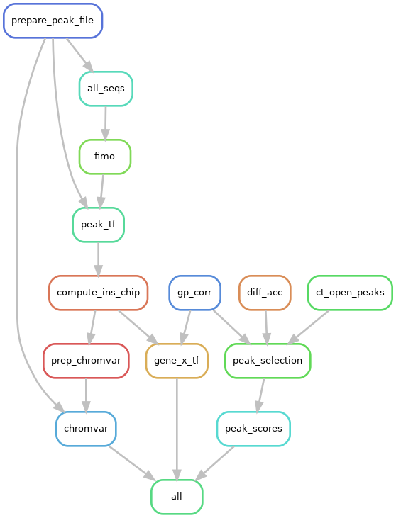

# geneTF

This repository contains a `snakemake` pipeline to produce `gene x TF` matrices, representing the regulatory potential of TFs on genes.

## Types of `gene x TF` matrices produced

Three versions of the `gene x TF` matrix are produced, each with a different proxy for quantifying regulation:

* sum of gene accessibility from ATAC
* sum of FIMO scores
* average gene accessibility, weighted by FIMO scores

## Visualization:

